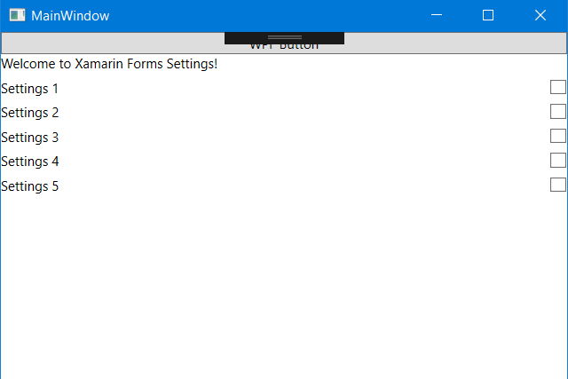

# Forms Embedding

At Microsoft Build 2017, Microsoft announced **Xamarin.Forms Embedding**, the ability to take any ContentPage and add it to your native applications.

More information: [https://blog.xamarin.com/unleashed-embedding-xamarin-forms-in-xamarin-native/](https://blog.xamarin.com/unleashed-embedding-xamarin-forms-in-xamarin-native/)

## Forms Embedding in WPF Backend

Here you can find a **sample** of using Forms Embedding with a WPF application.

## Feedback

Please use [GitHub issues](https://github.com/jsuarezruiz/forms-embedding-wpf/issues) for questions or comments.

## Copyright and license

Code released under the [MIT license](https://opensource.org/licenses/MIT).